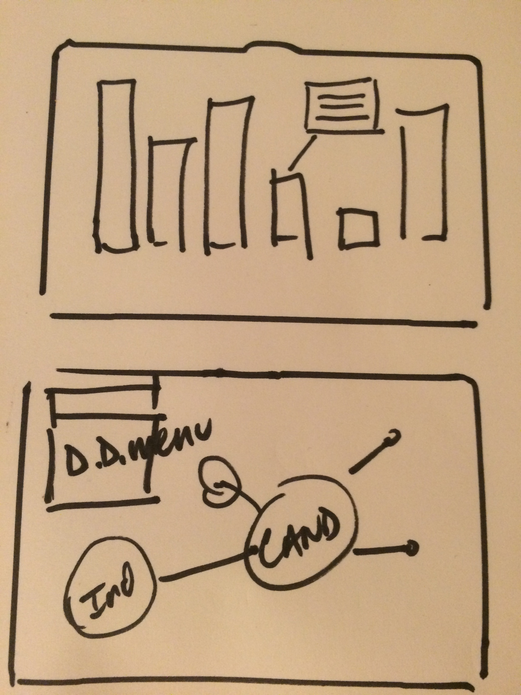

# Data Visualization of Campaign Information
### Data from [Federal Election Commission](https://api.open.fec.gov/developers) and [Sunlight Foundation](http://sunlightfoundation.com/api/) APIs

## Goal
- Use one or more APIs and D3.js to map realtime information on candidates in the 2016 election

## Objectives
- Map information from API to different types of D3.js charts
- Use D3.js animations
- Display information in a single page
- Deploy app on Heroku

## User Needs
- information on fundraising for 2016 campaign should be up-to-date within 24 hours
- users should be able to scroll through bar chart and see more detail on each candidate
- users should be interact with visualizations through animation

### Planning

#### this is the original wireframe

#### since the project did not require a database(other than external json file and API, there are no ERDs)

### Functionality I would like to add
ideally the page would have another chart and include more realtime information.
